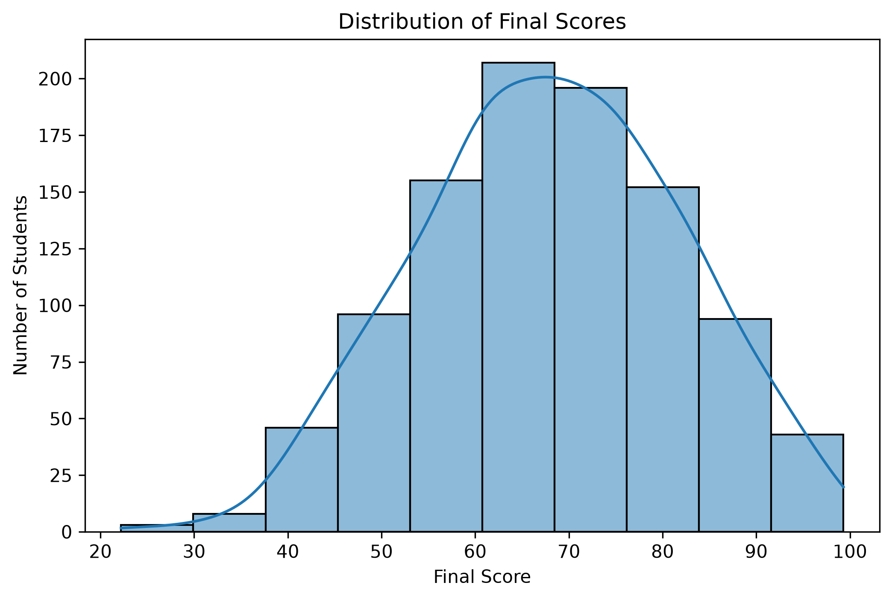
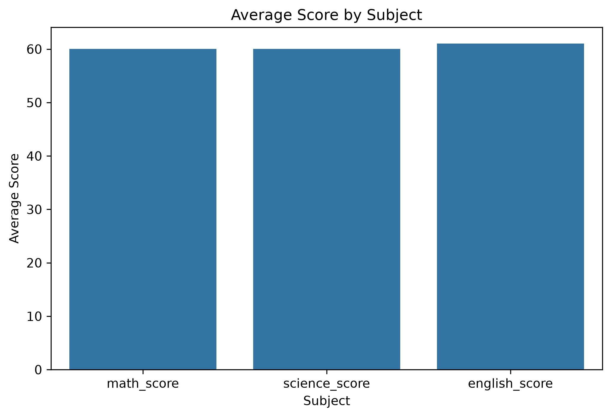
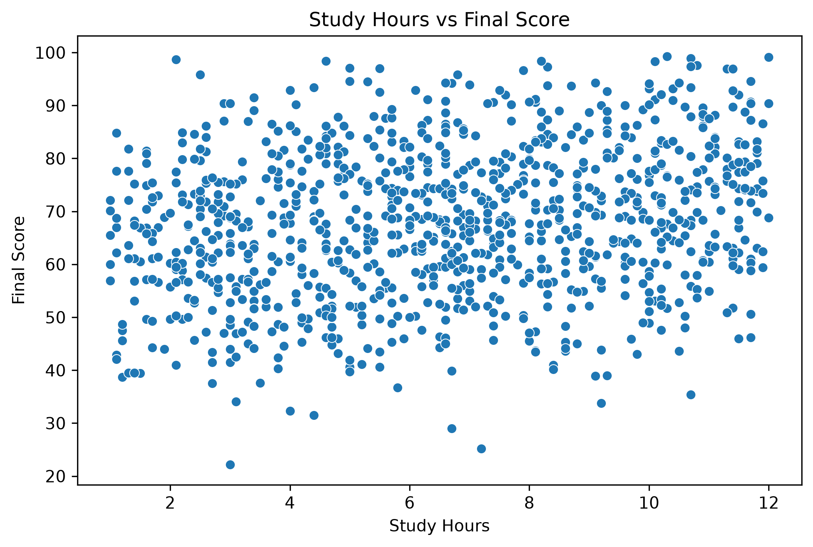
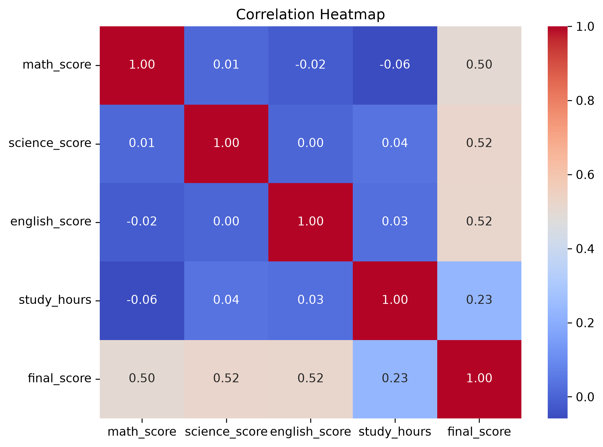
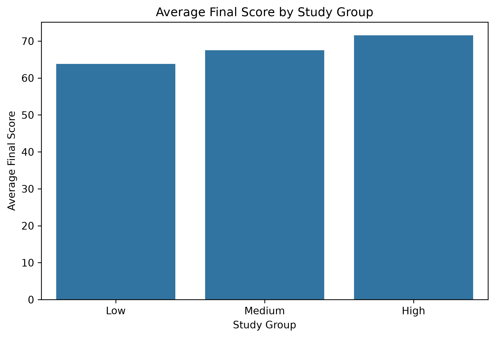
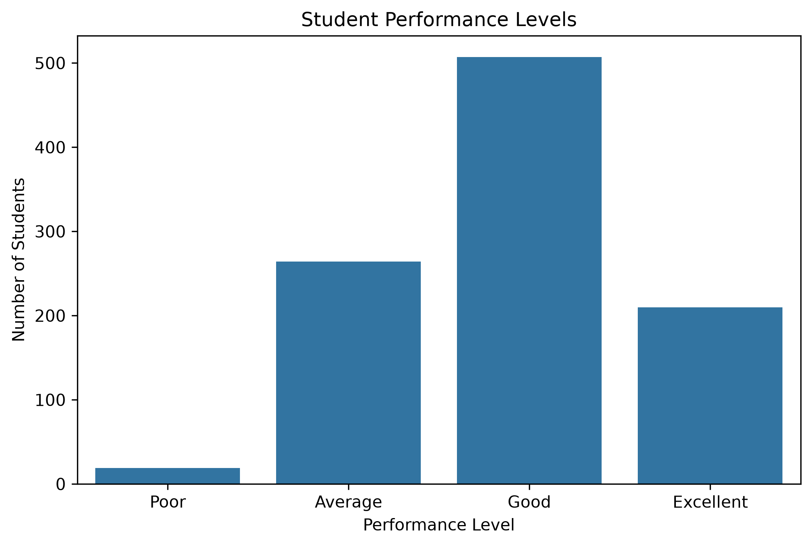
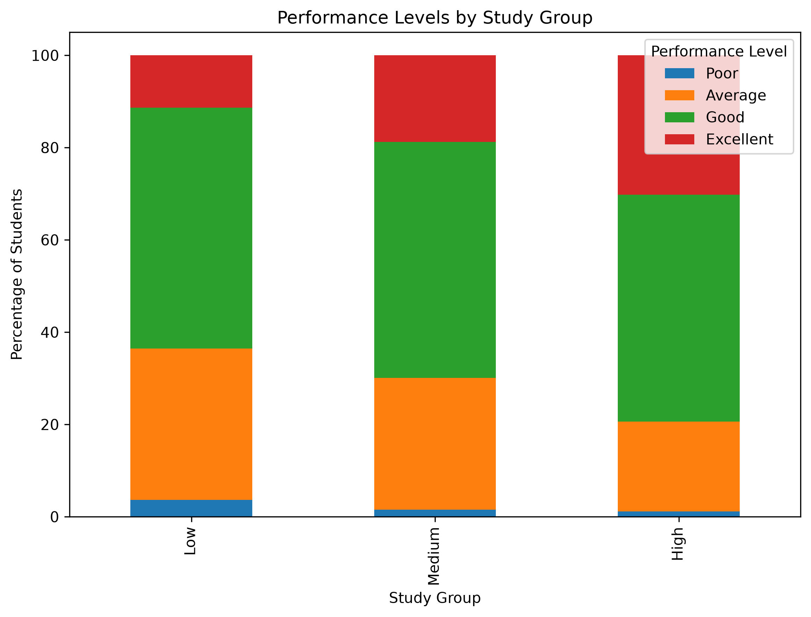

# Exam Score Analysis & Student Performance Insights using Python

## Project Overview

This project performs Exploratory Data Analysis (EDA) on a dataset containing students' Mathematics, Science, and English scores, study hours, and final scores.
The project focuses on cleaning the dataset, identifying data-quality issues, analyzing relationships between variables, and creating visualizations to understand student performance patterns.
The analysis also uses feature engineering to group students based on study hours and categorize them into different performance levels.

## Objectives

- Clean and prepare the student exam-score dataset for analysis.
- Identify and handle missing values and duplicate records.
- Detect and correct invalid score and study-hour values.
- Analyze the distribution of final scores.
- Compare average performance across subjects.
- Investigate the relationship between study hours and final scores.
- Analyze correlations between academic scores and final performance.
- Group students based on study hours.
- Categorize students into Poor, Average, Good, and Excellent performance levels.
- Identify patterns between study groups and performance levels.

## Technologies Used

- Python
- Pandas
- Matplotlib
- Seaborn
- VS Code

## Dataset Description

The dataset contains 1,020 student records and 5 variables related to academic performance and study habits.

| Column | Description |
|---|---|
| `math_score` | Student's Mathematics score |
| `science_score` | Student's Science score |
| `english_score` | Student's English score |
| `study_hours` | Number of hours spent studying |
| `final_score` | Student's final score |

The dataset intentionally contains common data-quality issues such as missing values, duplicate records, invalid score values, and negative study-hour values. These issues were identified and handled during the data-cleaning process.

## Data Cleaning

Several data-quality issues were identified and handled before performing the analysis.

### Missing Values

Missing values were found in:
- Mathematics scores
- Science scores
- English scores
- Study hours
The missing values were replaced using the median value of their respective columns.
After cleaning, all columns contained 0 missing values.

### Duplicate Records

The original dataset contained 20 duplicate rows.
These duplicate records were removed using Pandas `drop_duplicates()`.
After cleaning:
- Original rows: 1,020
- Rows after removing duplicates: 1,000
- Duplicate rows remaining: 0

### Invalid Values

The dataset contained invalid values such as:
- Mathematics scores greater than 100
- Science scores below 0
- Final scores greater than 100
- Negative study hours
Invalid score values were replaced with the median of their respective columns.
Negative study-hour values were also replaced with the median study-hour value.

### Final Data Validation

After cleaning:
- Missing values: 0
- Duplicate rows: 0
- Score values are within the valid 0–100 range.
- Study hours are within the valid range present in the cleaned dataset.
- Final dataset size: 1,000 rows × 5 columns.

## Exploratory Data Analysis

After cleaning the dataset, Exploratory Data Analysis was performed to understand student performance and identify relationships between academic scores, study habits, and final performance.
The analysis included:
- Final score distribution
- Average score comparison across subjects
- Study hours vs. final score analysis
- Correlation analysis
- Correlation heatmap
- Highest and lowest performing students
- Study-hour group analysis
- Performance-level analysis
- Performance levels by study group

## Visualizations

### 1. Distribution of Final Scores
This histogram shows how the final scores are distributed across the 1,000 students.


---

### 2. Average Score by Subject
This visualization compares the average scores in Mathematics, Science, and English.


---

### 3. Study Hours vs Final Score
The scatter plot shows the relationship between study hours and final scores.


---

### 4. Correlation Heatmap
The heatmap shows the correlation between academic scores, study hours, and final score.


---

### 5. Average Final Score by Study Group
Students were divided into Low, Medium, and High study-hour groups.


---

### 6. Student Performance Levels
Students were categorized into Poor, Average, Good, and Excellent performance levels based on their final scores.


---

### 7. Performance Levels by Study Group
This stacked bar chart compares the percentage distribution of performance levels across Low, Medium, and High study groups.



## Key Findings

The analysis produced several important observations:
- The average Mathematics score was approximately 60.01.
- The average Science score was approximately 60.05.
- The average English score was approximately 61.02.
- The average final score was approximately 68.02.
- English had the highest average score among the three subjects.
- Science had the strongest correlation with final score at approximately 0.52.
- English and Mathematics also showed moderate positive correlations with final score, approximately 0.52 and 0.50 respectively.
- Study hours showed a weaker positive correlation with final score of approximately 0.23.
- The High study group had the highest average final score (approximately 71.54), followed by the Medium group (67.52) and Low group (63.79).
- Good was the largest performance category, containing 507 students.
- The High study group had the largest percentage of Excellent-performing students (30.23%).
- The Low study group had the largest percentage of Poor-performing students (3.64%).
- The lowest final score was 22.2, while the highest final score was 99.3.

## Conclusion

This project demonstrated a complete Exploratory Data Analysis workflow using Python. The dataset was cleaned by handling missing values, removing duplicate records, and correcting invalid values before performing the analysis.

The analysis showed that Mathematics, Science, and English scores had moderate positive relationships with final scores, while study hours had a weaker positive relationship. Students in the High study group also showed a higher average final score and a larger proportion of Excellent performance compared with the Low and Medium study groups.

Overall, the project demonstrates how Python-based data cleaning, statistical analysis, feature engineering, and visualization can be used to extract meaningful insights from student performance data.

## Project Structure

```text
Exam_Scores_EDA/
│
├── 07_exam_scores.csv
├── 07_exam_scores_cleaned.csv
├── exam_scores_eda.py
├── exam_scores_eda_learning.py
├── README.md
│
└── screenshots/
    ├── final_score_distribution.png
    ├── average_score_by_subject.png
    ├── study_hours_vs_final_score.png
    ├── correlation_heatmap.png
    ├── average_final_score_by_study_group.png
    ├── performance_levels.png
    └── performance_levels_by_study_group.png

## How to Run

### 1. Clone the repository

```bash
git clone <YOUR_GITHUB_REPOSITORY_URL>

### 2. Navigate the required libraries
cd Exam_Scores_EDA

### 3. install the required libraries
pip install pandas matplotlib seaborn

### 4. Run the python code
python exam_scores_eda.py

## Learning Outcomes

Through this project, I gained practical experience in:

- Python-based data analysis
- Data loading and inspection using Pandas
- Handling missing values using median imputation
- Detecting and removing duplicate records
- Identifying and correcting invalid data
- Exploratory Data Analysis (EDA)
- Data visualization using Matplotlib and Seaborn
- Correlation and statistical analysis
- Feature engineering using categorical groups
- Outlier detection using the IQR method
- Interpreting patterns and relationships in data
- Presenting analytical findings through visualizations

## Note

The dataset used in this project is intended for educational and analytical purposes. The findings represent patterns observed within this dataset and should not be interpreted as proof of causal relationships between study habits and academic performance.